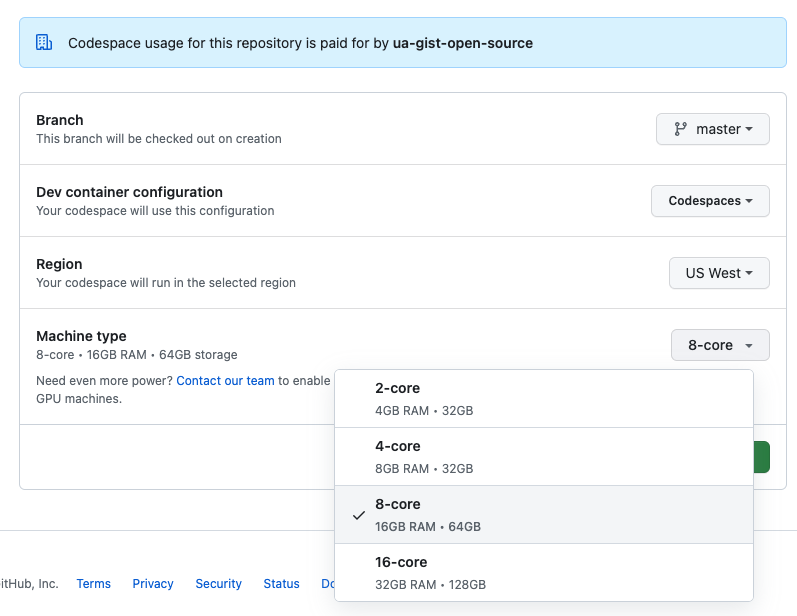

# Python Programming with Rasterio
## Assignment
In this assignment you will learn about the `rasterio` library and interact with Sentinel scenes in an AWS cloud bucket. You will also learn about Cloud-Optimized Geotiffs (COGs) and the Spatio-Temporal Asset Catalog (STAC) specification.

## Background
You have learned how to use the `geopandas` library to interact with geospatial vector data. The next step is to interact with raster data. The primary library that we use for raster is `rasterio`.Due to the nature of raster datasets and, in large part because of continous earth observation from satellites, a number of standards and technologies have built around optimizing finding raster datasets and utilizing subsets of raster datasets without necessitating the download of copious amounts of imagery that end users have no interest in. The main concepts we will talk about here are Cloud-Optimized Geotiffs, or COGs, windowed reads, and the Spatio-Temporal Asset Catalog (STAC) standard for searching for satellite imagery and other spatio-temporal data.

Background reading:
- COGs
  - https://developers.planet.com/docs/planetschool/an-introduction-to-cloud-optimized-geotiffs-cogs-part-1-overview/
- Rasterio
  - Windows Reading: https://rasterio.readthedocs.io/en/latest/topics/windowed-rw.html
- STAC
  - Intro to STAC: https://stacspec.org/en/tutorials/intro-to-stac/
  - About STAC: https://stacspec.org/en/about/stac-spec/ 

## Housekeeping
### Learning Objectives
1) Become familiar with python libraries: `rasterio` and `satsearch`.
2) Learn about Cloud-Optimized Geotiffs (COGs)
3) Learn about Spatio-Temporal Asset Catalogs (STACs)

## A special kind of codespace
This assignment will be conducted through your codespace for this repo but we will have to beef up our codespace virtual machine to accomodate some extra disk space we will need.
- Create a new branch, `rasterio`
- Click on `Code` and under the `Codespace` tab, click on the `...` and select `New with options` to bring up a new menu

- In the new tab/window for `Create codespace`, change the `Machine Type` to `8-core` and then click `Create codespace`

## Assignment
The rest of the instructions for the assignment can be found in the Jupyter Notebook, `assignment.ipynb`.

## Deliverables
Submit a pull request to merge your `rasterio` branch with `master` (but do not merge). The `rasterio` branch should include:
- `stac-items.png`
- `image-numpy.png`
- `image-plots.png`
- `fields.png`
- `ndvi-time-series.png`
